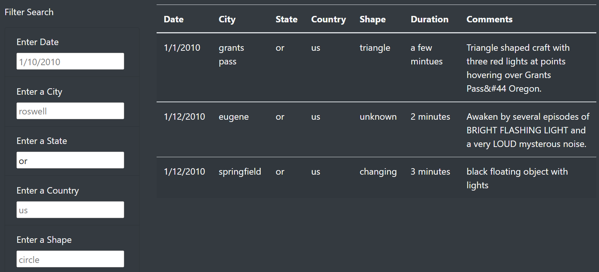

# UFO Analysis 

## Overview of Project
### Purpose of Project
In this project, I demonstrated my proficiency with various JavaScript and HTML features including: using console.log() to debug code, d3.select(), arrow functions, forEach() with JavaScript objects, filters with d3.select(), if-else statements, list-group-item class, label, and input tags to add filtered data to an index.html file, and script tags for your code to an index.html file. 

### Background of Project
Dana, a journalist, has a JavaScript datafile about UFO sightings that she wants to organize and display. I built a table using data stored in a JavaScript array. Then, I created filters that it will react to user input, and placed the table into an HTML file for easy viewing. Users will be able to search the data by date, city, state, country, and shape of the UFO sightings. 

---
## How to Perform a Filtered Search 
The “Filter Search” allows users to search for UFO sightings by date, city, state, country, or shape. The search can be done using any combination of filters. For example, a user could search by just the state of Oregon, just triangle shaped UFOs, or by a combination of the state of Oregon and triangle shaped UFOs.  

### FORMATING 
* Date is entered as MO/DA/YEAR
* State and Country are entered using their two letter abbreviations 

### HOW TO SEARCH 
ADD FILTER 
* Choose any filter  
* Type your criteria 
* Hit Enter [table will adjust] 
* OPTIONAL: repeat for remaining filters

REMOVE FILTER 
* Choose filter you want to remove
* delete text
* Hit Enter [table will adjust]

    

### EXAMPLE
**Example 1: You want to search for sightings in the state of Oregon**
**Example 2: You want to adjut your search so the table displays sightings in the state of Oregon that were in the shape of a triangle**
**Example 3: You want to adjust your search so the table displays sightings that were in the shape of a triangle**

filter_or filter_or_triangle filter_triangle 

Results:

There is a description of how to perform a search, with images. (4 pt)

---
## Summary
Summary:
1. Summary: In a summary statement, describe one drawback of this new design and two recommendations for further development.

The summary addresses one drawback of this webpage (2 pt)
The summary addresses two additional recommendations for further development (4 pt)
### My Reccomendation 
According to the data, Louise's play with a funding goal of $10,000 should be launched in May, June, or July and avoid a launch in October or December. Her current funding goal has a 54% chance of succeeding. If she could cut costs in half, her success rate would increase to approximately 70%. 

### Limitations 
Many of the limitations of this dataset come from the donation collection. For example, the method of how donations are collected is unclear. Is the crowdfunding solely from an online platform like GoFundMe or were there other collection methods? If there were other collection methods, then which one was most successful? Are successful campaigns funded primarily by online methods, in-person methods, or a mix of the two? Why are campaigns with zero backers included in this dateset?

### Digging Deeper 
Louise's biggest concern is likely her funding goal. Would it be possible to reduce her funding goal to increase her chances of success? The data suggests- yes! Although cutting her budget from 10,000 to 5,000 could increase the likehood of her success from 50% to 70%, that is a substantial cut which could negatively impact the quality of her play. What would her chances of success be if her goal was 9,000 or 8,000? I would want to narrow the Outcomes vs Goals graph to funding goals of 0 to 11,000 and break down the percentage of success by increments of 500. This would help me make better suggestions than cutting her goal from 10,000 to 5,000. 

Another factor I am interested in is the amount of an average donation. Once Louise sets a funding goal, it would be helpful to know how much she should ask backers for. Should she put her time and energy into finding many backers to make smaller donation or a few backers into making larger donations? A line graph comparing successful/failed campagins by number of backers and average donation could help Louise make better decisions about who she will ask to fund her play.  

Dropdown menu – helpful for states, countryies, and shapes
A list of possible shapes 
A printout of what was searched and the number of sightings for that input 
